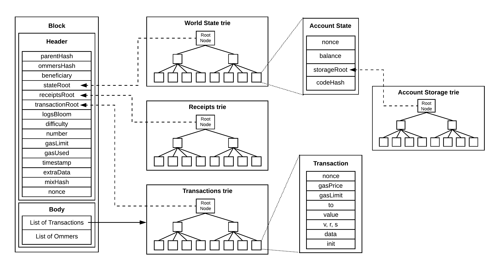

# State trie
- State trie (or world state trie) is a Merkle Patricia Trie where key is `keccak256(accountAddress)` and value is `rlp(accountState)`. `accountAddress` could be EOA or contract address.

- `accountState` is consisted of 4 fields:
  - `nonce`: Starting from 0 for EOA and from 1 for contract account. Nonce is increased when an EOA made a transaction. In the case of contract account, the nonce is increased when a new contract creation is made from this account.
  - `balance`: Number of `wei` in the account.
  - `storageRoot`: Each account has their own account storage, so `storageRoot` is the 256-bit hash of the root node of the account storage (known as storage trie). In the case of EOA, `storageRoot` is hash of an empty trie.
  - `codeHash`: Hash of the EVM code of this account, known as runtime bytecode. For EOA, this equal to hash of empty string.

# Account storage trie
- Account storage trie existed for contract accounts.

All tries could be summarize in the picture below

